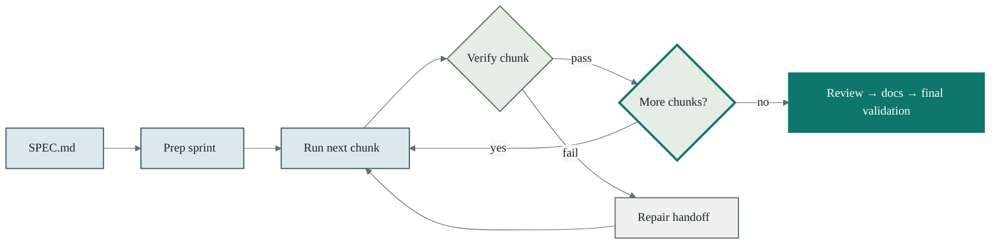
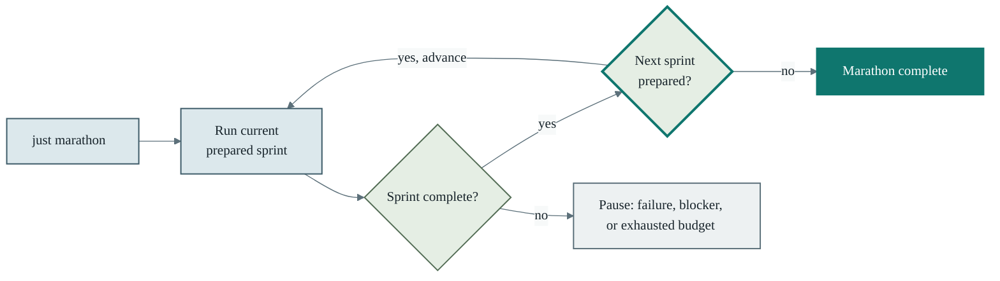

# Agent Skills

[](https://github.com/zacharygcook/agent-skills/actions/workflows/validate.yml)
[](#install)
[](LICENSE)

Practical, evidence-first workflows for coding agents: safer repository changes, trustworthy tests
and reviews, and controlled long-running work.

## Install

Install the collection in the current project:

```bash
npx skills add zacharygcook/agent-skills
```

Or install one workflow:

```bash
npx skills add zacharygcook/agent-skills@agent-readiness
```

Add `-g` to install globally.

## The readiness loop

<picture>
  <source media="(prefers-color-scheme: dark)" srcset="assets/agent-readiness-loop-dark.svg">
  <source media="(prefers-color-scheme: light)" srcset="assets/agent-readiness-loop-light.svg">
  
</picture>

## The Ralph loop

Readiness makes a repository safe to work in. Ralph takes over when the work is clearly scoped and
you want a controlled, long-running implementation loop.



`just run` completes the current prepared sprint and pauses. `just marathon` runs that same loop, then
advances only to the next sequential sprint that is already prepared—it never plans new work. It ends
cleanly when no next sprint is ready, and pauses with durable state on a failure, blocker, or exhausted
budget.

### Marathon mode



## Quickstart

### 1. Establish agent readiness

```text
$setup-agent-skills on my system
```

It inspects your machine and repository, finds available coding agents and prerequisites, then
recommends a small relevant set. It asks before installing anything. Optionally add one or two
preferences, such as “for this repo” or “for Codex.”

Then assess the repository before asking an agent to work autonomously:

```text
$agent-readiness audit this repo and suggest improvements
```

It produces a read-only, evidence-backed assessment and the highest-value next improvements.

To make that assessment reusable:

```text
$agent-readiness walk me through setting up my preferences
```

It helps tailor repository preferences without overwriting an existing file.

### 2. Run a Ralph loop

Once the repository is ready and you have a `SPEC.md` plus credible validation commands:

```text
$ralph-loop set up a loop for this repository from SPEC.md
```

It preflights the repository, confirms the runtime choices with you, prepares and validates the
first sprint, then stops before execution. Use `$ralph-sprint` to prepare later work,
`$ralph-status` to inspect progress, and `$ralph-review` to assess a completed sprint.

## Skills shipped with this package

### Repository readiness and autonomous work

- [`setup-agent-skills`](skills/setup-agent-skills) — Inspect the machine and repository, then
  recommend and install a focused set of skills with approval.
- [`agent-readiness`](skills/agent-readiness) — Audit and improve how safely and
  effectively coding agents can work in a repository.
- [`ralph-loop`](skills/ralph-loop) — Run hardened, resumable autonomous implementation loops.
- [`ralph-sprint`](skills/ralph-sprint) — Turn a specification into the next reviewable sprint.
- [`ralph-status`](skills/ralph-status) — Report truthful Ralph progress without changing state.
- [`ralph-review`](skills/ralph-review) — Review a Ralph sprint before accepting it.
- [`repo-cleanup-auditor`](skills/repo-cleanup-auditor) — Find evidence-backed cleanup candidates,
  then wait for approval before changing files.
- [`staged-script-rollout`](skills/staged-script-rollout) — Run live-writing scripts through dry
  runs, limited execution, audit, ramp-up, and rollback.

### Testing and review

- [`local-web-e2e`](skills/local-web-e2e) — Build and debug reliable local browser test suites.
- [`good-test-bad-test`](skills/good-test-bad-test) — Distinguish behavior tests from coverage
  theater and temporary proof tests.
- [`expand-test-coverage`](skills/expand-test-coverage) — Add meaningful coverage and fix real
  defects it exposes.
- [`code-review`](skills/code-review) — Perform adversarial, evidence-backed code review.
- [`handle-automated-code-review`](skills/handle-automated-code-review) — Verify and triage AI or
  automation review findings.
- [`triage-stale-pull-requests`](skills/triage-stale-pull-requests) — Decide whether an old pull
  request should be closed, salvaged, refreshed, or merged.

### Codebase health and artifacts

- [`ban-type-assertions`](skills/ban-type-assertions) — Replace TypeScript casts with safer
  narrowing, validation, or API design.
- [`fix-knip-unused-exports`](skills/fix-knip-unused-exports) — Resolve unused exports without
  suppressing or disguising dead code.
- [`ui-css-performance`](skills/ui-css-performance) — Keep UI source, Tailwind scanning, CSS, and
  dependencies small and measurable.
- [`postgres-queue-health`](skills/postgres-queue-health) — Diagnose Postgres queue performance,
  MVCC, vacuum, indexes, and retention.
- [`perplexity-research`](skills/perplexity-research) — Run current, citation-backed research.
- [`mermaid-diagrams`](skills/mermaid-diagrams) — Create, render, and verify diagrams as code.
- [`local-html-pdf-reports`](skills/local-html-pdf-reports) — Create polished local Markdown, HTML,
  PDF, and rendered report artifacts.

### Developer experience

- [`design-human-first-cli`](skills/design-human-first-cli) — Design short, safe, discoverable CLI
  workflows for people and automation.
- [`write-public-readme`](skills/write-public-readme) — Write a clear public README that gets users
  to a trustworthy first result quickly.

## License

Released under the [MIT License](LICENSE).
